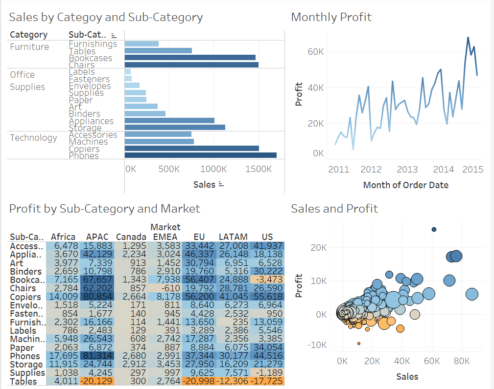

# Tableau Sales and Profit Analysis Dashboard

This Tableau dashboard provides a comprehensive analysis of sales and profit metrics, detailed across various dimensions. It is designed to offer insights into sales performance, profit trends, and the distribution of profits across different markets and product categories. The dashboard consists of four interconnected charts:

### 1. Sales by Category and Sub-Category (Bar Chart)
- **Description**: This bar chart breaks down total sales by category and sub-category, offering a clear view of which product lines are driving the most revenue.
- **Interactivity**: A filter action allows users to select specific categories or sub-categories and see the corresponding details across other charts on the dashboard.

### 2. Monthly Profit (Line Chart)
- **Description**: This line chart tracks monthly profit changes from 2011 to 2014, illustrating trends and fluctuations in profitability over time.
- **Interactivity**: The chart updates based on selections made in the bar chart and highlight table, providing a focused view of profit trends for selected data points.

### 3. Profit by Sub-Category and Market (Highlight Table)
- **Description**: This highlight table presents profit data broken down by sub-category and market. The color coding allows for quick identification of high and low-profit areas.
- **Interactivity**: Similar to the bar chart, a filter action is applied here to enable users to select specific sub-categories or markets, updating the other charts accordingly.

### 4. Sales and Profit (Scatter Plot)
- **Description**: This scatter plot visualizes the relationship between sales and profit, detailed by product name and sub-category. The size of each circle represents the quantity of orders, while the color represents aggregated profit, offering a multi-dimensional view of the data.
- **Interactivity**: A highlight action is used here, allowing users to select data points from the bar chart or highlight table and see the corresponding points highlighted in the scatter plot without removing other data points.

### Interactivity and User Experience
- **Filter Actions**: Implemented for the bar chart and highlight table, these actions enable dynamic filtering across the dashboard, providing a cohesive and interactive experience.
- **Highlight Actions**: Applied to the scatter plot, these actions allow users to highlight specific data points based on selections from the bar chart or highlight table, facilitating focused analysis while maintaining context.

### Usage
This dashboard is ideal for analysts and decision-makers who need to:
- Assess sales performance across different product categories and sub-categories.
- Monitor profit trends over time.
- Understand the distribution of profits across various markets.
- Explore the relationship between sales, profit, and order quantities for detailed product analysis.

By leveraging the interactive features of Tableau, this dashboard offers an engaging and insightful way to analyze and visualize key sales and profit metrics.
