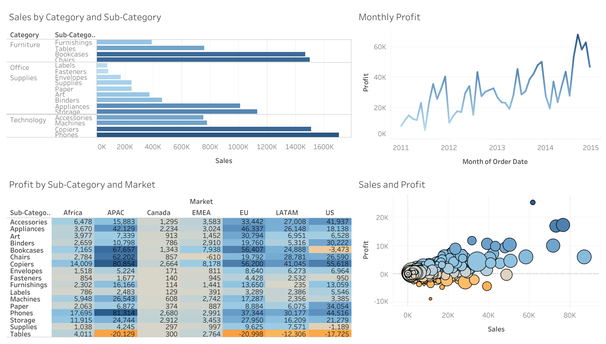

# Sales and Profit Analysis Dashboard

An interactive Tableau dashboard analyzing sales and profit performance across product categories, markets, and time. Built to identify where sales volume is and isn't translating into profitability.

🔗 **[View the live interactive dashboard on Tableau Public](https://public.tableau.com/app/profile/fahimeh.fotouhi/viz/SalesandProfitAnalysisDashboard_17840212491260/Sales_Profit_Dashboard)**

## Business Question

Which product sub-categories and markets are generating high sales but weak or negative margins, and where should pricing or discounting be revisited?

## Key Finding

Several sub-categories, notably **Tables** and **Bookcases**, show strong sales volume but negative or thin profit margins in specific markets (e.g. Tables in the US and Bookcases in LATAM), while lower-volume categories like Copiers deliver disproportionately high profit. This points to a discounting or pricing issue concentrated in furniture rather than a broad demand problem.

## Dashboard Overview

The dashboard consists of four interconnected charts:

### 1. Sales by Category and Sub-Category (Bar Chart)
- **Description**: Breaks down total sales by category and sub-category, showing which product lines drive the most revenue.
- **Interactivity**: A filter action lets users select specific categories or sub-categories, updating all other charts on the dashboard accordingly.

### 2. Monthly Profit (Line Chart)
- **Description**: Tracks monthly profit from 2011 to 2014, highlighting trends and fluctuations in profitability over time.
- **Interactivity**: Updates dynamically based on selections made in the bar chart and highlight table.

### 3. Profit by Sub-Category and Market (Highlight Table)
- **Description**: Presents profit broken down by sub-category and market, with color coding to quickly spot high- and low-profit areas.
- **Interactivity**: A filter action lets users select specific sub-categories or markets, updating the other charts accordingly.

### 4. Sales and Profit (Scatter Plot)
- **Description**: Visualizes the relationship between sales and profit by product name and sub-category. Circle size represents order quantity; color represents aggregated profit.
- **Interactivity**: A highlight action lets users select points from the bar chart or highlight table and see the corresponding points highlighted here, without removing other data points from view.

## Interactivity and User Experience

- **Filter actions**: Implemented on the bar chart and highlight table for dynamic, cross-chart filtering.
- **Highlight actions**: Applied to the scatter plot to focus on selected data points while retaining context.

## Tools Used

Tableau Desktop / Tableau Public, data cleaning via Tableau's Data Interpreter.

## Usage

This dashboard is intended for analysts and decision-makers who need to:
- Assess sales performance across product categories and sub-categories
- Monitor profit trends over time
- Understand how profit is distributed across markets
- Explore the relationship between sales, profit, and order quantity for individual products

## Files

- `Sales_Dashboard.twbx` — Packaged Tableau workbook (includes embedded data extract, no separate dataset file needed)
- `Dashboard.png` — Static preview of the dashboard
